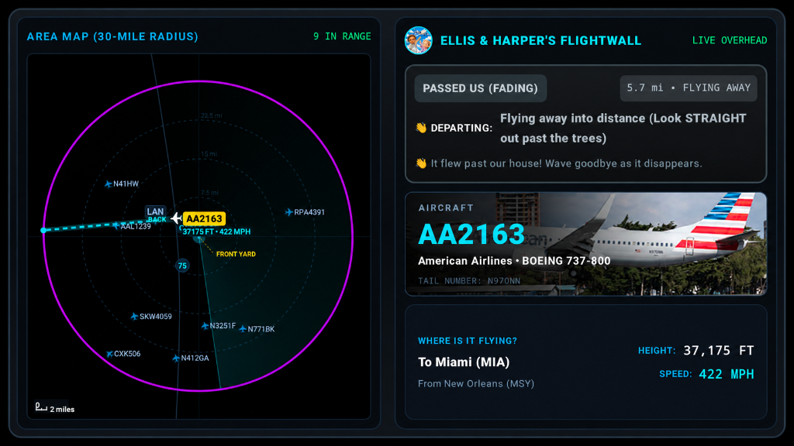

# ✈️ Find The Plane — Family Flightwall (Android TV Starter Kit)

**Find The Plane** is a live airspace radar and aircraft spotter app designed for **Android TV, Google TV, and Amazon Fire TV Sticks**.

Built specifically for families, kids, and aviation enthusiasts, the app turns any living room TV into a dedicated, ambient flightwall that tracks aircraft flying over your neighborhood in real time. When a plane approaches your home, the app identifies the airline and aircraft type, sounds an alert chime, and gives kids direct, intuitive spotting directions based on your house's layout (*"RUN TO FRONT YARD! Look high to your left!"*).

<p align="center">
  
</p>

---

## ✨ Features

- 🛰️ **Live ADS-B Radar**: Continuously scans local airspace via the [OpenSky Network API](https://opensky-network.org/) within configurable ranges (5, 10, 20, or 30 miles).
- 🧭 **Kid Spotter Guidance**: Automatically calculates compass bearings relative to your front and back doors. Tells kids exactly which door to run to, which yard to look into, and what angle in the sky to search (*"Look halfway up, above the rooftops"*).
- 🔴 **2-Mile Flyover Proximity Alert**: Sounds an audible chime and activates a glowing radar beacon whenever an aircraft enters the close flyover zone.
- 🛩️ **Flight & Aircraft Enrichment**: Automatically resolves airline callsigns, route origins, destinations, flight numbers, aircraft models (Boeing 737, Airbus A321, Gulfstream, Piper, Cessna), and displays high-resolution matching aircraft photos.
- 🎮 **Full TV Remote Control**:
  - **D-Pad Left / Right**: Zoom radar in or out (5 mi, 10 mi, 20 mi, 30 mi).
  - **D-Pad Up / Down**: Cycle between nearby aircraft in your airspace.
  - **Center Button (Select)**: Toggle interactive Demo Simulation mode.
- 📺 **OLED / Leanback Optimized**: OLED-safe deep space background, 16:9 Leanback banner support for Android TV / Fire TV home screens, and smooth hardware-accelerated Compose rendering.

---

## 🚀 Quick Start: 2-Minute AI Setup

All personalization (your GPS location, door orientations, and family branding) is centralized in a single configuration file:
[`app/src/main/java/com/airwall/radar/data/AppConfig.kt`](app/src/main/java/com/airwall/radar/data/AppConfig.kt).

### 🤖 LLM Configuration Prompt
You can copy and paste the prompt below into **ChatGPT, Claude, or Gemini** to automatically generate your customized `AppConfig.kt`:

```markdown
I have cloned the "Find The Plane" Android TV Flightwall starter kit.
Please configure `AppConfig.kt` for my house:

- My Street Address: [INSERT YOUR ADDRESS, CITY, STATE/COUNTRY]
- Front Door / Driveway faces: [e.g. South towards the street, or compass heading if known]
- Back Door / Patio faces: [e.g. North towards the yard/trees]
- Family / App Title: [e.g. "THE MILLER FAMILY" or "FLIGHTWALL"]
- Nearest Airport (optional): [e.g. "ORD", "DTW", "LAX" or leave empty]

Instructions for the assistant:
1. Look up the precise Latitude and Longitude for this address.
2. Determine the compass bearing (0° to 360°, where North=0°, East=90°, South=180°, West=270°) for the front door and back door orientations.
3. If an airport was provided, provide its IATA code, latitude, longitude, and main runway heading.
4. Output the complete, drop-in replacement Kotlin code for `AppConfig.kt`.
```

---

## 🛠️ Configuration Reference (`AppConfig.kt`)

If configuring manually, open [`app/src/main/java/com/airwall/radar/data/AppConfig.kt`](app/src/main/java/com/airwall/radar/data/AppConfig.kt) and adjust the parameters:

```kotlin
object AppConfig {
    // 1. Home Location (GPS Coordinates)
    // Tip: Right-click your house on Google Maps and click the coordinates to copy.
    const val HOME_LAT: Double = 39.8283
    const val HOME_LON: Double = -98.5795
    const val HOME_LABEL: String = "OUR HOUSE"
    const val LOCATION_LABEL: String = "LOCAL AIRSPACE"

    // 2. Observer Door Angles (0° - 360°)
    // North = 0°, East = 90°, South = 180°, West = 270°
    const val FRONT_DOOR_HEADING: Double = 180.0
    const val FRONT_DOOR_LABEL: String = "FRONT DOOR"
    const val FRONT_YARD_LABEL: String = "FRONT YARD"

    const val BACK_DOOR_HEADING: Double = 0.0
    const val BACK_DOOR_LABEL: String = "BACK DOOR (Backyard)"
    const val BACKYARD_LABEL: String = "BACKYARD"

    // 3. App Title & Branding
    const val APP_TITLE: String = "FIND THE PLANE"
    const val APP_SUBTITLE: String = "FAMILY FLIGHTWALL"

    // 4. Default Radar Radius & Alert Distance
    const val DEFAULT_RADIUS_MILES: Double = 10.0
    const val CLOSE_FLYOVER_MILES: Double = 2.0

    // 5. Optional Local Airport Landmark (Runway on Radar)
    const val LOCAL_AIRPORT_CODE: String = "" // e.g., "ORD", "DTW"
    const val LOCAL_AIRPORT_LAT: Double = 0.0
    const val LOCAL_AIRPORT_LON: Double = 0.0
    const val LOCAL_AIRPORT_RUNWAY_ANGLE_DEG: Double = 90.0
}
```

---

## 📦 Building and Installing

### Prerequisites
- Java Development Kit (JDK 17 or higher) or [Android Studio](https://developer.android.com/studio).
- Android SDK Platform-Tools (`adb`).
- An Android TV, Google TV, or Amazon Fire TV connected to your local Wi-Fi network.

### 1. Enable Developer Options & ADB on Your TV
- **Android TV / Google TV**:
  1. Go to **Settings > System > About**.
  2. Scroll to **Android TV OS build** and click it **7 times** until you see *"You are now a developer!"*.
  3. Go to **Settings > System > Developer options** and turn **USB debugging** (and Network debugging if available) **ON**.
- **Amazon Fire TV Stick**:
  1. Go to **Settings > My Fire TV > About**.
  2. Click the device name **7 times** to unlock Developer Options.
  3. Go to **Settings > My Fire TV > Developer Options**.
  4. Turn **ADB Debugging** and **Apps from Unknown Sources** to **ON**.

### 2. Connect via ADB over Wi-Fi
Find your TV's IP address under **Settings > Network** (e.g., `192.168.1.50`), then run in your terminal:

```bash
adb connect <YOUR-TV-IP>:5555
```
*(Accept the authorization prompt that appears on your TV screen).*

Verify the connection:
```bash
adb devices
```

### 3. Build the APK
Run the Gradle wrapper:

- **Windows (PowerShell)**:
  ```powershell
  .\gradlew.bat assembleDebug
  ```
- **macOS / Linux**:
  ```bash
  ./gradlew assembleDebug
  ```

### 4. Install onto Your TV
Install the compiled APK directly over the network:

```bash
adb -s <YOUR-TV-IP>:5555 install -r app/build/outputs/apk/debug/app-debug.apk
```

To launch the app directly:
```bash
adb -s <YOUR-TV-IP>:5555 shell monkey -p com.airwall.radar -c android.intent.category.LAUNCHER 1
```

---

## 📁 Project Architecture

```
app/src/main/
├── AndroidManifest.xml                  # TV leanback launcher configuration
├── assets/
│   ├── aircraft/                        # Jet & turboprop livery reference photos
│   └── app_logo.jpg                     # Radar vector header logo
├── res/
│   ├── drawable/                        # 16:9 TV banners & app icons
│   └── raw/alert_chime.wav              # Proximity alert audio
└── java/com/airwall/radar/
    ├── MainActivity.kt                  # TV activity entry point & D-pad key events
    ├── data/
    │   ├── AppConfig.kt                 # Centralized user settings & coordinates
    │   ├── AircraftState.kt             # ADS-B telemetry data class
    │   ├── FlightEnricher.kt            # Kid spotter algorithm & metadata enrichment
    │   ├── FlightMetadata.kt            # Flight details & stage modeling
    │   └── OpenSkyApi.kt                # ADS-B HTTP client with bounding-box math
    └── ui/
        ├── RadarScreen.kt               # Root TV view & periodic polling loop
        ├── RadarMapView.kt              # Hardware-accelerated radar canvas & trails
        ├── FlightOverviewPanel.kt       # Left-hand flight details & spotter card
        └── theme/                       # Futuristic high-contrast dark palette
```

---

## 📡 ADS-B Data Source
This project uses the free, public tier of the **[OpenSky Network API](https://opensky-network.org/)**.
- No API key is strictly required for local, modest polling intervals (every 10 seconds).
- For higher frequency queries, you can supply your free OpenSky credentials in `OpenSkyApi.kt`.

---

## 📄 License
This project is open-source under the [MIT License](LICENSE). Feel free to adapt and expand it for your family or local aviation community!
